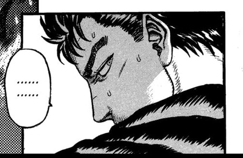
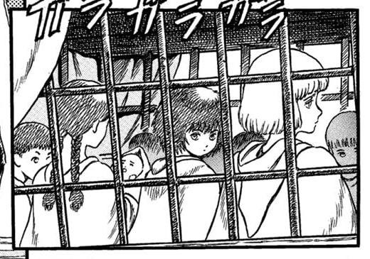
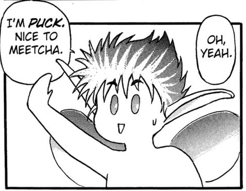
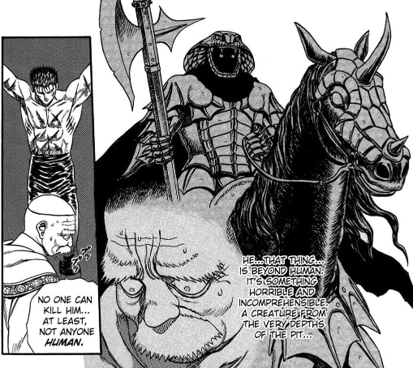
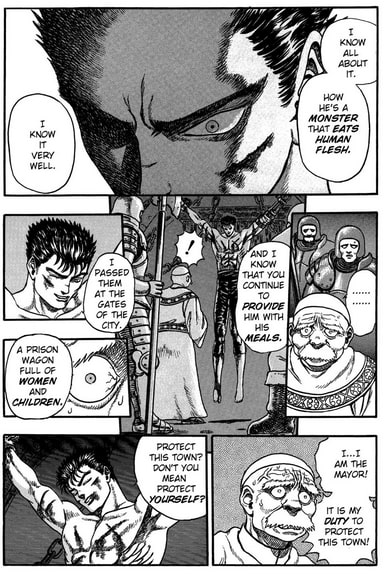
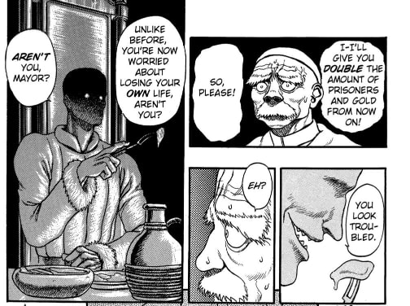
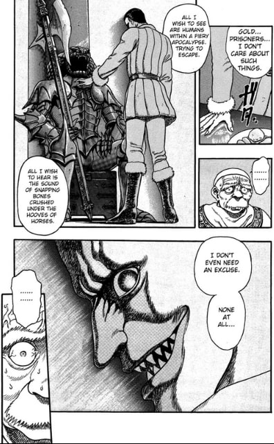
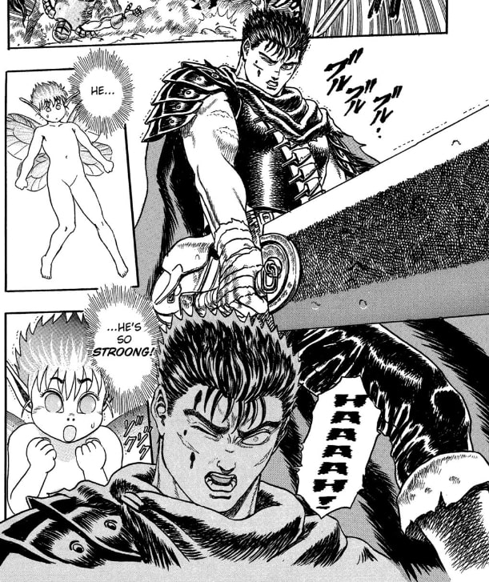
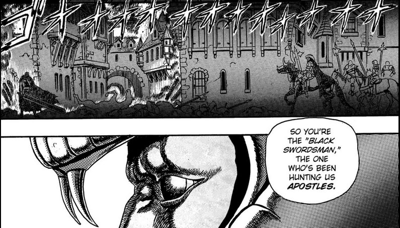
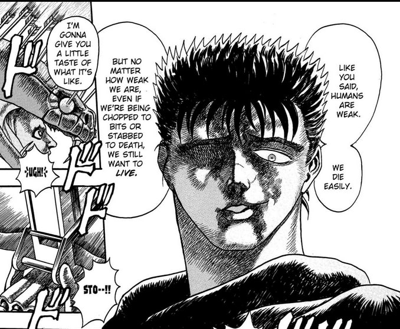

## O começo

:::warning

Este conteúdo aborda detalhes da trama de Berserk. Contém spoilers. Além disso,
Berserk é uma obra que retrata cenas explícitas. Não reproduzo nenhuma dessas
cenas diretamente, mas o texto pode conter a descrição de algumas delas. Clique
em "ler mais" caso você não se importe.

:::

<!-- truncate -->

O começo de Berserk se tornou infame por ser uma cena que muitos dizem não ter
nada a ver com a história que vem pela frente. Muitos consideram a cena como um
exemplo de conteúdo explícito gratuito.

Logo na primeira página do primeiro
capítulo, o que se apresenta para o leitor é uma cena em que um homem e uma
mulher tem relações sexuais. Em menos de dois painéis, a dinâmica muda
radicalmente quando a mulher se transforma em um demônio e revela que o humano
caira em uma armadilha. Em mais uma página outra reviravolta acontece quando o
humano revela que estava preparado e usa um canhão portátil para matar o
demônio. Essa é a primeira vez que vemos o rosto do protagonista de Berserk,
**Guts**.

 

Sim, a cena é gráfica. Sim, provavelmente Berserk poderia começar com o que vem
logo a seguir, sem essa introdução. Não, a cena não é completamente gratuita.

Geralmente obras que apresentam cenas com conteúdo explícito são acusadas de
estar fazendo isso apenas para causar choque e, portanto, essas cenas poderiam
ser removidas da obra sem perda alguma para a história que está sendo contada.
*Game of Thrones* sofreu bastante com este tipo de acusação. Sim, muitas vezes
esse tipo de cena é utilizada para chocar a audiência. Não, isso não significa
que nada é perdido quando tiramos essas cenas. O que o leitor *sente* é tão
importante quanto o que o leitor *entende* de uma trama.

A primeira cena de Berserk causa *repulsa* tanto pelo ato em si quanto pela
maneira como ele foi desenhado e disposto nas páginas. É uma cena extremamente
detalhada e cansativa. Não vemos o rosto do protagonista até que ele revela que
sabia exatamente onde estava se metendo e essa revelação mostra um rosto com
feições mais demoniacas que o próprio monstro, que agora parece assustado.

 

É uma cena carregada e que precisa de apenas quatro páginas para mostrar o que
o mundo de Berserk guarda para o leitor. A sensação é de *repulsa*, *cansaço* e
*apreensão*. Logo no final da cena, em um painel no canto da página, aparece um
detalhe que revela muito sobre a decisão de iniciar a trama com uma cena como
essa: **Guts também se sentiu dessa forma**.

 

## Puck, o elfo

O próximo destino de Guts aparece logo na página seguinte: uma cidade
fortificada, claramente situando a obra em um ambiente de idade média.

Guts aparece entrando na cidade em meio a guardas, mendigos e carruagens. Uma
dessas carruagens chama a sua atenção. É uma carruagem carregando crianças e
mulheres dentro do que parece ser uma jaula.

 

Logo em seguida, a cena muda para uma taverna. Nela, conhecemos um dos
personagens mais importantes de Berserk e o primeiro personagem que começa a
nos mostrar de forma mais clara o que existe por trás dos panos do personagem
principal. Estou falando de **Puck, o elfo**.

 

Existe um constraste muito claro entre a cena inicial de Berserk e a introdução
de um personagem com traços tão cartunescos e fantasiosos. Na verdade, dentro
da própria cena em que é introduzido, Puck já parece fora de lugar. Eu não acho
que essa escolha é um descuido do autor. Berserk é uma obra *pesada*. A leveza
que um personagem como o Puck consegue trazer entre essas cenas mais carregadas
é necessária para que a experiência não seja maçante. Para comprovar isso,
basta olhar para a adaptação de 1998. Eles escolheram adaptar essa etapa da
história sem incluir o Puck e isso fez com que o começo do anime seja
reconhecido por quase todos que assistiram como uma parte monótona.

Além disso, existe outra função essencial para o Puck na trama, mas vou esperar
até que seja relevante para comentar sobre ela.

Puck é introduzido amarrado e sendo usado como alvo para arremesso de facas
pelos soldados de um castelo que fica nas imediações da cidade. Guts chega e de
forma nada cerimoniosa assassina todos os soldados, exceto um. Para esse, ele
avisa para levar ao seu lorde a seguinte mensagem:

**O espadachim negro chegou**

Essa cena destaca a capacidade de Miura de criar cenas coesas, muito cinéticas
e com um nível de detalhe nos desenhos que indica um comportamento *obsessivo*
que anos depois cobraria dele a sua saúde. Logo nesses primeiros capítulos já
dá para entender o motivo pelo qual ele é uma **lenda** entre os autores de
manga. Quando Guts usa a sua espada (que é *grande demais para ser chamada de
espada. Massiva, espessa e malacabada, era mais como um pedaço de ferro bruto*)
é um **evento**.

 

Aqui também novamente aparece a tendência de representar o personagem principal
com *feições demoníacas* sempre que ele entra em ação. Guts não parece um
protagonista. Muitas vezes, ele não parece nem humano. Nada disso é por acaso.
Nesse primeiro volume a ~falta de~ humanidade de Guts é um dos pontos centrais
e a cena a seguir exemplifica isso.

Guts deixa a taverna quase que imediatamente após passar sua mensagem, sem se
importar em desamarrar o elfo. Puck se desamarra e o segue pelas ruas,
comentando que ele mexeu com os soldados do *castelo Koka*, que só não destroem
a cidade completamente pois o prefeito tem um tipo de acordo com o lorde que
comanda o castelo. Isso significa que o que Guts fez pode ter colocado a cidade
inteira em risco. Guts não emite uma única palavra até que Puck resolve pousar
no seu ombro, quando ele simplesmente alerta: *não me encoste ou eu vou te
esmagar*.

Completamente em sincronia com o aviso de Puck, os guardas da cidade aparecem
para levar Guts para a masmorra. Lá, ele é torturado até que o prefeito aparece
para conversar com ele.

## O apóstolo

 

A conversa com o prefeito também é um momento que pauta a discussão sobre a
humanidade de Guts. Após sabermos que o lorde de *Koka* sabe quem é o
espadachim negro e considerando a cena inicial do volume, fica claro que caçar
esses monstros é algo que o Guts não fez só uma ou duas vezes; é uma caçada
deliberada e que ele conduz há tempo o suficiente para ficar conhecido entre os
monstros. Isso só deixa ainda mais significativo quando o prefeito explica que
ele *não tinha o que fazer*. Que ninguém conseguiria matar o lorde de Koka. Ao
menos não **alguém que seja humano**. 

Como um contraponto imediato, temos a maior manifestação de humanidade do Guts
até aqui. Ele confronta o prefeito sobre o que ele *escolheu* fazer em nome da
segurança da sua cidade. Nessa conversa, a expressão de Guts quando menciona
que sabe exatamente o tipo de monstro com quem está lidando assim como a
maneira como ele escolhe confrontar o prefeito sobre o que ele imediatamente
percebeu que era uma oferenda de mulheres e crianças para acalmar o lorde é
profundamente humana.

 

O que acontece a seguir oferece um contraste que deixa a humanidade de Guts
ainda mais clara. O prefeito vai até o castelo de Koka e se humilha perante o
lorde. De forma muito similar ao que Guts faz, o lorde confronta o prefeito e o
expõe como alguém que usa o bem coletivo como um pretexto para se proteger. A
diferença aqui é que Guts, antes de assumir uma postura provocativa, demonstra
uma expressão de profunda indignação com o que estava sendo feito na cidade. Já
o lorde de Koka, bom... As imagens dizem tudo.

 

 

Enquanto Guts se ocupa em escapar da masmorra, o lorde de Koka se prepara e
inicia um massacre na cidade. Ele e sua cavalaria de mercenários assassina
todos que cruzam o seu caminho sem se importar se são soldados, homens,
mulheres, crianças ou idosos.

Em meio ao caos, Guts aparece e junto com ele a tendência de Miura de desenhar
o Guts em ação como um monstro. No entanto, cada vez mais aparecem rachaduras
nessa representação de um monstro. Sinais claros de cansaço e esforço
descomunais aparecem em determinados momentos das cenas de ação.

 

Inevitavelmente, chegamos ao momento que se construiu desde o primeiro momento
deste volume; o confronto entre o ~questionavelmente~ humano Guts e o
inquestionável monstro, o **apóstolo** e lorde de Koka. Temos aqui também a
confirmação de que de fato Guts caça esses monstros, que se chamam de
**apóstolos**.

 

O confronto começa e imediatamente após sobreviver a diversas flechadas no
rosto, o apóstolo assume o que é sua provável forma original; um híbrido entre
humano e cobra. Assim que a transformação acontece, a luta é completamente
dominada pelo apóstolo. Guts, que até então só tinha mostrado lampejos de
humanidade, agora deixa claro o quão difícil é para ele sobreviver a esses
encontros com os apóstolos. Guts não é um herói típico de shounen, ele não tem
algum poder especial que o torna o único a ser capaz de enfrentar esses
monstros. Não há mais dúvidas ao ver essa batalha, Guts é decididamente apenas
um humano.

 

O que torna Guts especial é apenas um aparente instinto de sobrevivência
extremamente apurado e incapacidade de desistir. E justamente no momento em que
o apóstolo desdenhava da humanidade de Guts, ele consegue uma abertura para se
libertar e usa sua espada em mais um *double-spread* monumental de Miura.

Aqui o tema da humanidade é mais uma vez reforçado com Guts devolvendo as
provocações do apóstolo e mencionando que a fragilidade humana é perfeitamente
contraposta com a sua vontade de viver. Diferente de Guts, o apóstolo se coloca
em uma posição de implorar por sua vida.

 

Se antes havia um princípio de posicionar Guts como protagonista e o apóstolo
como antagonista, essa premissa se desfaz ao final do volume. Guts apresenta um
comportamento obsessivo e profundamente vingativo com relação aos apóstolos e o
grupo que descobrimos estar hierarquicamente acima dos apóstolos, os **membros
da mão divina**. Ao mesmo tempo, ele demonstra que não consegue suprimir sua
capacidade de empatia e o quanto não é imune à dor e o esforço de caçar os
apóstolos, algo que mesmo assim ele faz constantemente. 

Guts não só é humano, como é um arquétipo daquilo que pode ser entendido como a
forma mais terrena de humanidade. Pecados, dor e progresso mesmo frente a uma
tarefa aparentemente impossível. A humanidade de Guts é ao mesmo tempo impura e
pura, sem qualquer traço do messianismo visto em obras que posicionam o
protagonista como *o escolhido* ou *o predestinado*. Para antagonizar esse tipo
de humanidade, Berserk precisa de algo (ou alguém) que se coloque *acima da
humanidade*. O apóstolo de Koke não é esse antagonista.

## O humano
