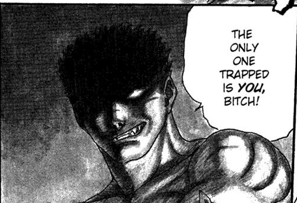
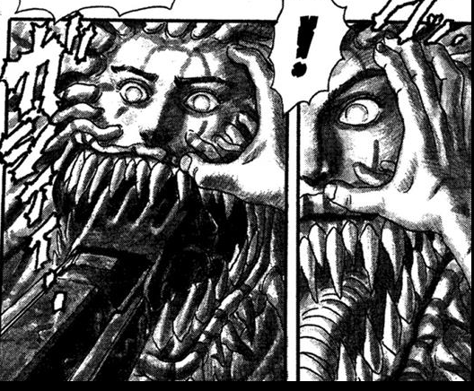

:::warning

Este conteúdo aborda detalhes da trama de Berserk. Contem spoilers.

:::

## O começo

O começo de Berserk se tornou infame por ser uma cena que muitos dizem não ter
nada a ver com a história que vem pela frente. Muitos consideram a cena como um
exemplo de conteúdo explícito gratuito.

Logo na primeira página do primeiro
capítulo, o que se apresenta para o leitor é uma cena em que um homem e uma
mulher tem relações sexuais. Em menos de dois painéis, a dinâmica muda
radicalmente quando a mulher se transforma em um demônio e revela que o humano
caira em uma armadilha. Em mais uma página outra reviravolta acontece quando o
humano revela que estava preparado e usa um canhão portátil para matar o
demônio. Essa é a primeira vez que vemos o rosto do protagonista de Berserk,
**Guts**.

 

Sim, a cena é gráfica. Sim, provavelmente Berserk poderia começar com o que vem
logo a seguir, sem essa introdução. Não, a cena não é completamente gratuita.

Geralmente obras que apresentam cenas com conteúdo explícito são acusadas de
estar fazendo isso apenas para causar choque e, portanto, essas cenas poderiam
ser removidas da obra sem perda alguma para a história que está sendo contada.
*Game of Thrones* sofreu bastante com este tipo de acusação. Sim, muitas vezes
esse tipo de cena é utilizada para chocar a audiência. Não, isso não significa
que nada é perdido quando tiramos essas cenas. O que o leitor *sente* é tão
importante quanto o que o leitor *entende* de uma trama.

A primeira cena de Berserk causa *repulsa* tanto pelo ato em si quanto pela
maneira como ele foi desenhado e disposto nas páginas. É uma cena extremamente
detalhada e cansativa. Não vemos o rosto do protagonista até que ele revela que
sabia exatamente onde estava se metendo e essa revelação mostra um rosto com
feições mais demoniacas que o próprio monstro, que agora parece assustado.

 

É uma cena carregada e que precisa de apenas quatro páginas para mostrar o que
o mundo de Berserk guarda para o leitor. A sensação é de *repulsa*, *cansaço* e
*apreensão*. Logo no final da cena, em um painel no canto da página, aparece um
detalhe que revela muito sobre a decisão de iniciar a trama com uma cena como
essa: **Guts também se sentiu dessa forma**.

 

## Puck, o elfo

